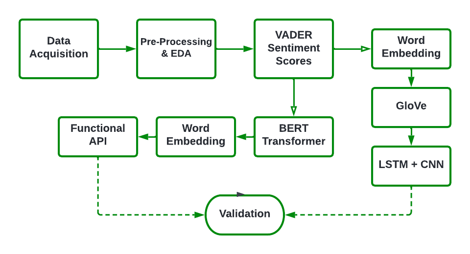
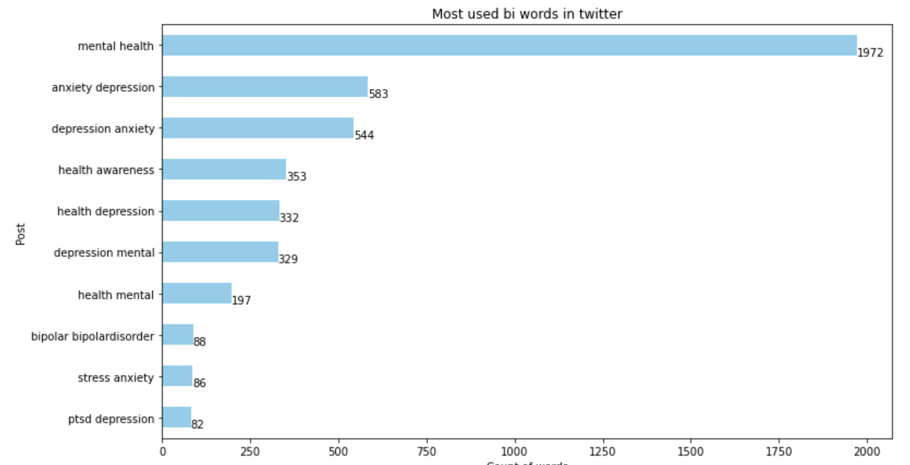
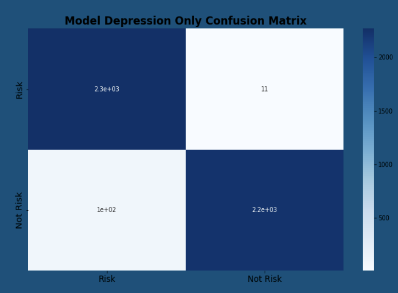
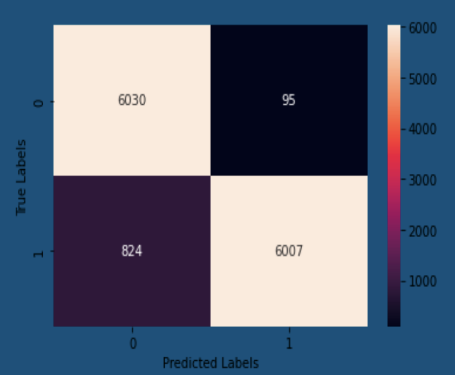

# Mental-Health-Risk-Assessment
### Group 6: Preethi Panyam, Martin Berberi Deepshika Sharma

# Introduction
The COVID-19 pandemic has had an alarming effect on mental health across the world; it has triggered a 25% increase in depression worldwide and its impacts have been associated with an increase in suicidal ideation. Emergency department visits for mental health conditions and suicide attempts have greatly risen. 

Further, these stastics behind the rise in depression & suicidal ideation may are likely underreported (as many are undiagnosed), suggesting the mental health crisis is bigger than what is reported. Admist this crisis, mental health providers have struggled to meet the increase in demand for services. 

Many of those unable to receive professional services turn to social media to express their struggles and concerns regading their depression and suicidal ideation. 

# Goal
The primary goal of this study is to build a model that can conduct a mental health risk assessment of online posts and user text data. Specifically, we will examine whether it is possible to determine a person’s extent of depression or risk for self injurious behavior based on running their online text posts through an NLP-based neural network algorithm.  

# Data 
For our text corpus, we had two main classes: 'risky text' & 'neutral text.' All of our data was acquired from Reddit & Twitter. For our 'risky text' corpus, we webscraped 5,000 posts from the twitter hashtag '#depression', 10,000 posts from the subreddit r/depression, and 15,000 posts from the subreddit r/suicidewatch. For our 'neutral text', we acquired 15,000 posts from the subreddit r/happy, and 10,000 posts from the subreddit r/exercise. 

The overall workflow of our data acquisition, exploration and modeling process is illustrated below:

## Pre-processing & EDA
We cleaned our datasets by dropping any rows with missing text values; our final dataset consisted of 51,900 posts (27, 700 posts for the 'risky text' class & 24,200 posts for the 'netural text' class). We then checked for the most commonly occuring words in our datasets using CountVectorizer, TF-IDF vectorizer, and checking for n-grams (including unigrams, bigrams & trigrams). We also tested custom stop words. 

Below is a bar gaph showing the most commonly occuring bigrams from our twitter data:

## VADER Sentiment Scores
The next step was converting the data into Sentiment Scores using the VADER SentimentIntensityAnalyzer to get a sense of the differences in negativity vs. neutrality between our classes. As expected, we found the data we acquired from r/suicide watch had the highest percentage of negative sentiment scores (with ~40% scoring in the range of -.8 to -1). After converting our data to sentiment scores, we merged our databases prior to modeling. 

# Modeling

## BERT with Functional API
The first model we ran utilized the neural network transformer BERT and a Functional API. BERT (i.e. Bidirectional Encoder Representations from Transformers) utilizes a transformer with a built-in attention mechanism that learns the contextual relationships between the words and sub-words of the input text. Rather than reading text input sequentially (eitehr from left-to-right or right-to-left), BERT's transformer encoder is able to read an entire sequence of words at once and learn the relationship of words based on their entire context. The Functional API (via keras) essentially builts a graph of layers that can handle multiple inputs and outputs, and allows more flexibility than Sequential models.

There were three types of models we ran with BERT: the first model included both 'risky text' classes (i.e. r/suicide watch & the depression text from Reddit & Twiiter), a model that included only the suicidal ideation text in the 'risky text' class, and finally a model that only included the depression text. 

## GloVe with LSTM & CNN
We also utilized a GloVe learning algorithm along with the Recurring Neural Network LSTM (Long Short-Term Memory) in addition to a Convolutional Neural Network (CNN). GloVe is an unsupervised learning model that vectorizes words and assigning meaning based on word-word co-occurence (based on a log-bilinear model using a weighted least squares objective) and has successfully used in other studies to predict the risk levels of online text inputs about mental health. 

Two GloVe models were run: the first only utilized LSTM, and the second used LSTM along with a CNN.

# Results

## BERT Model

| Model | Accuracy | Recall | 
|---|---|---|
|1: Both suicidal & depressive text|0.83|0.84|
|2: Suicidal Ideation text only |0.98|0.98|
|3: Depression text only|0.98| 0.96|

The first model did not perform as well compared to the latter two, as both the accuracy and recall score were not very high (0.83 & 0.84 respectively). Model 2 had a slightly better recall (0.02 higher) than the Model 3, which only used depression text, but the accuracy scores were equivalent (0.98). Though Model 2 was slightly better than Model 3, we decided to move forwared with Model 2 (depression text only) was better at predicting the validation text (more details below).  

## GloVe Model

| Model | Accuracy | Recall | 
|---|---|---|
|LSTM only|0.81|0.91|
|LSTM & CNN |0.95|0.96|

The best model consisted of layers of LSTM and CNN. The accuracy and recall score was better than the baseline model which consisted only of an LSTM layer. The baseline model had an accuracy score of 0.81 and recall of 0.91 whereas the final model had an accuracy score of 0.95 and recall of 0.96.

## Validation
In order to validate our final model, we used both text posts from an archived Tumblr 'Depression & Disorders' and text from the clinically validated diagnostic the Beck Depression Inventory - II (BDI-II). We also ran some self-generated neutral text through the models. The BDI-II is a 21-item clinical diagnostic tool that utilizes a likert scale from 0-3 (higher values indicating higher depression levels) to evaluate the level of depression someone is experiencing. The results of the BDI-II categorize each person between a range of 'normal ups and downs' to 'extreme depression'. Since we are most interested in optimizing for the Recall (as to not miss categorizing any actually risky text), the text corresponding to higher levels of depression were used from the scale (i.e. the ones categorized as '3'). The idea behind using both user-text and empirically validated depression measure to validate our models was to ensure that our final model can reliably recognize high-risk text with a similar efficacy of a clinical diagnostic. 

Running the validation text through our models revealed that the model with the best predictive power was the BERT Model that only utilized the depression text for the 'risky text' class. Though the recall score for the BERT Model that used the suicidal ideation text (without depression text) was higher, we found that this model continuously categorized netural text as high risk for depression. Since both models mentioned performed well on detecting high-risk depressive text, we decided to move forward with the BERT Model that utilized only the depression text.

Thus, the accuracy for our final model was 98%, with a recall of 96%.

# Interpretation
Based on our results, we can determine that it is possible to detect the extent (i.e. risk level) of depression a person is experiencing, but it is difficult to conclusively predict whether someone may be at risk for self-injurious behavior. We found that the models that included only the depression text (from Twitter and Reddit) but not the suicidal ideation text performed best when predicting the risk level of text input.

The models may have not performed as well with the suicidal ideation text because of the various nuances and limitations of Natural Language Processing models. Specifically, both the BERT & GloVe models take into account the co-occurence of words; this is slightly problematic in the case of mental health text because 'positive words' (i.e. good, better, happy) are almost always contained within the high-risk text. Though these 'positive words' are stated inversely (i.e. 'not feeling good', 'never gets better'), they are difficult to account for in the model because they are often phrased in different ways/contexts. 

Further, self-injurious behavior is not always an indication of high-risk, as many use self-harm as a coping mechanism without actually experiencing any comorbid suicidal ideation.

It is also important to note that context is extremely important, and that many people use words sarcastically that actually are not indicative of mental health risk (i.e. saying they "will die" if their favorite musician delays a release). Thus, future models should take this into account as well.

# Future Applications
The final model can be useful in a couple of contexts. Since many people don't have access to professional mental health services, and/or resort to social media to vent and express their feelings, there may be times that someone's posts can trigger worry among those who see it. Thus, an app can be designed that helps concerned family and friends determine the risk level of their loved one's posts and whether or not they need to check-in with them. Further, a mental health app can be built for individuals that takes in their self-reported text input and offers resources if their text is determined to be risky or concerning. 

In conclusion, our NLP-based mental health risk detection model (once optimized) can be extremely useful in predicting the extent of someone's depression level, which may one day save lives. 
